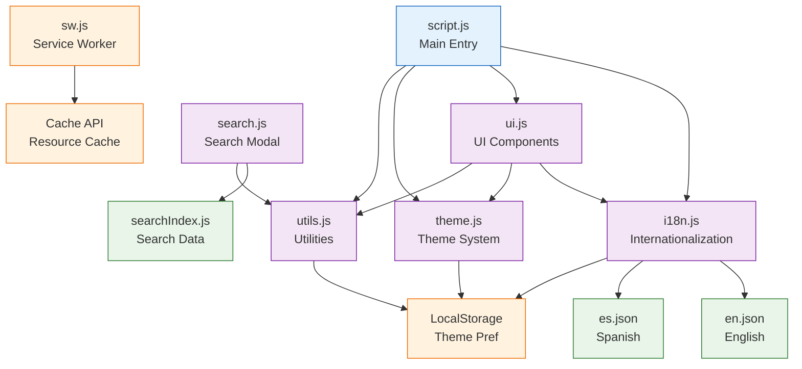

# Code Structure & Module Organization

## Directory Structure

```
portfolio/
├── index.html                 # Home page
├── proyectos.html            # Projects page
├── sobre-mi.html             # About page
├── manifest.json             # PWA manifest
├── sw.js                     # Service Worker
├── assets/
│   ├── css/
│   │   ├── _variables.css    # CSS custom properties
│   │   ├── _base.css         # Base styles and resets
│   │   ├── _layout.css       # Layout utilities
│   │   ├── _components.css   # Component styles
│   │   ├── _utilities.css    # Utility classes
│   │   └── _responsive.css   # Responsive breakpoints
│   ├── js/
│   │   ├── script.js         # Main initialization
│   │   ├── i18n.js           # Internationalization
│   │   ├── ui.js             # UI components & navigation
│   │   ├── search.js         # Search functionality
│   │   ├── searchIndex.js    # Search data index
│   │   ├── theme.js          # Theme management
│   │   └── utils.js          # Utility functions
│   ├── i18n/
│   │   ├── en.json           # English translations
│   │   └── es.json           # Spanish translations
│   └── cv.pdf                # Resume download
└── docs/                     # Documentation (generated)
```

## Module Architecture

### ES6 Module Dependencies



## Module Descriptions

### Core Modules

#### 1. script.js - Main Entry Point
**Purpose**: Application initialization and coordination  
**Responsibilities**:
- Register Service Worker
- Initialize i18n system
- Set up global event listeners
- Load Lucide icons

**Key Functions**:
- DOMContentLoaded event handler
- Service Worker registration
- Module initialization coordination

**Dependencies**: All core modules

#### 2. i18n.js - Internationalization
**Purpose**: Multi-language support and content translation  
**Responsibilities**:
- Language detection and switching
- Translation loading and caching
- DOM element translation
- Language persistence

**Key Classes**:
- `I18n`: Main internationalization class
- Language detection utilities
- Translation management functions

**Dependencies**: LocalStorage, JSON translation files

#### 3. ui.js - User Interface Components
**Purpose**: UI rendering and interaction management  
**Responsibilities**:
- Sidebar and navigation generation
- Topbar creation and updates
- Page layout management
- UI state coordination

**Key Functions**:
- `generateSidebar()`: Sidebar HTML generation
- `generateTopbar()`: Topbar HTML creation
- `updateTopbar()`: Dynamic topbar updates
- Navigation data structures

**Dependencies**: i18n, theme, utils modules

#### 4. theme.js - Theme Management
**Purpose**: Light/dark theme switching and persistence  
**Responsibilities**:
- Theme detection and application
- System preference monitoring
- Theme persistence in LocalStorage
- CSS custom property management

**Key Functions**:
- `toggleTheme()`: Theme switching logic
- `getValidatedTheme()`: Theme validation
- System preference detection

**Dependencies**: LocalStorage API

#### 5. utils.js - Utility Functions
**Purpose**: Shared utility functions and cross-cutting concerns  
**Responsibilities**:
- Common DOM operations
- Browser API integrations
- Animation and interaction helpers
- Cross-cutting functionality

**Key Functions**:
- `sharePage()`: Web Share API integration
- `downloadCV()`: File download handling
- `toggleReadingMode()`: Reading mode toggle
- Intersection Observer setup

**Dependencies**: Browser APIs, Service Worker

### Feature Modules

#### 6. search.js - Search Functionality
**Purpose**: Client-side search with modal interface  
**Responsibilities**:
- Search modal management
- Query processing and filtering
- Result rendering and highlighting
- Search input handling

**Key Functions**:
- `openSearchModal()`: Modal display
- `performSearch()`: Search execution
- `renderResults()`: Result display
- `highlightText()`: Text highlighting

**Dependencies**: searchIndex.js, utils.js

#### 7. searchIndex.js - Search Data
**Purpose**: Pre-built searchable content index  
**Responsibilities**:
- Store structured page content
- Provide fast search lookups
- Support keyword and content matching
- Enable offline search capability

**Structure**: Array of search objects with metadata

**Dependencies**: None (static data)

### Supporting Files

#### 8. sw.js - Service Worker
**Purpose**: Progressive Web App functionality  
**Responsibilities**:
- Resource caching and offline support
- Background updates and synchronization
- Cache management and versioning
- Network request interception

**Key Events**:
- `install`: Initial cache population
- `activate`: Cache cleanup
- `fetch`: Request handling and caching

**Dependencies**: Cache API

#### 9. manifest.json - PWA Manifest
**Purpose**: App installation and metadata  
**Responsibilities**:
- Define app properties for installation
- Specify icons and display modes
- Configure PWA behavior
- Provide app metadata

**Dependencies**: None (static configuration)

## Module Loading Strategy

### Script Loading Order
```html
<!-- Core dependencies first -->
<script src="assets/js/i18n.js"></script>
<script src="assets/js/searchIndex.js" defer></script>
<script src="assets/js/ui.js" defer></script>
<script src="assets/js/theme.js" defer></script>
<script src="assets/js/search.js" defer></script>
<script src="assets/js/utils.js" defer></script>
<script src="assets/js/script.js" defer></script>
```

### Loading Strategy Rationale
1. **i18n.js** loads immediately (critical for content)
2. **searchIndex.js** deferred (large data, loaded when needed)
3. **UI modules** deferred (depend on DOM readiness)
4. **script.js** last (coordinates initialization)

### Initialization Flow
1. **Immediate Execution** (i18n.js self-executing)
   - Language detection
   - Translation loading
   - Basic DOM translation

2. **DOMContentLoaded** (script.js)
   - Service Worker registration
   - Module-specific initialization
   - Event listener setup

3. **Lazy Loading** (search.js)
   - Search modal on first use
   - Search index loading on demand

## CSS Architecture

### Modular CSS Organization
- **_variables.css**: CSS custom properties for theming
- **_base.css**: Base styles, typography, resets
- **_layout.css**: Layout utilities and grid systems
- **_components.css**: Component-specific styles
- **_utilities.css**: Utility classes and helpers
- **_responsive.css**: Media queries and breakpoints

### CSS Custom Properties Strategy
```css
:root {
  --ui-bg: #FFFFFF;
  --text-primary: #37352F;
  --accent-blue: #0A7AFF;
}

html.dark {
  --ui-bg: #191919;
  --text-primary: #EAEAEA;
  --accent-blue: #3291FF;
}
```

### CSS Loading Strategy
- **Critical CSS**: Inline for above-the-fold content
- **Modular Loading**: Separate files for different concerns
- **Theme Variables**: Dynamic theming through CSS properties
- **Utility Classes**: Tailwind-inspired utility system

## Data Flow Architecture

### State Management
- **Local State**: Component-level state management
- **Persistent State**: LocalStorage for user preferences
- **Session State**: In-memory state for current session
- **Shared State**: Global state through module coordination

### Data Flow Patterns
1. **User Action** → **DOM Event** → **Module Handler** → **State Update** → **UI Update**
2. **Language Change** → **i18n Module** → **Translation Load** → **DOM Update**
3. **Theme Toggle** → **Theme Module** → **CSS Class Toggle** → **Persistence**
4. **Search Query** → **Search Module** → **Index Query** → **Result Display**

### Event-Driven Architecture
- **Custom Events**: `languageChanged`, `i18nReady`
- **DOM Events**: Click, input, scroll events
- **Browser Events**: Online/offline, visibility change
- **Module Communication**: Direct function calls and callbacks

## Performance Optimizations

### Loading Optimizations
- **Defer Non-Critical Scripts**: Use `defer` attribute
- **Lazy Load Search Data**: Load index on first search
- **CDN Resources**: External fonts, CSS, icons
- **Service Worker Caching**: Stale-while-revalidate strategy

### Runtime Optimizations
- **Efficient DOM Queries**: Cached selectors where possible
- **Debounced Inputs**: Search input debouncing
- **Intersection Observer**: Lazy loading animations
- **Minimal Re-renders**: Targeted DOM updates

### Bundle Size Management
- **No Bundler**: Static files served directly
- **Tree Shaking**: Manual elimination of unused code
- **External Dependencies**: CDN-hosted libraries
- **Modular Loading**: Code split by functionality

## Development Workflow

### File Organization Principles
- **Feature-based**: Related files grouped together
- **Separation of Concerns**: CSS, JS, HTML, data separated
- **Modular Architecture**: Independent, reusable modules
- **Scalable Structure**: Easy to add new features

### Naming Conventions
- **Files**: kebab-case (e.g., `search-index.js`)
- **Functions**: camelCase (e.g., `performSearch()`)
- **Classes**: PascalCase (e.g., `I18n`)
- **Constants**: UPPER_SNAKE_CASE (e.g., `CACHE_NAME`)

### Code Quality Standards
- **JSDoc**: Comprehensive documentation for all public APIs
- **ES6+**: Modern JavaScript features and syntax
- **Error Handling**: Try-catch blocks and graceful degradation
- **Accessibility**: ARIA attributes and keyboard navigation

## Maintenance Considerations

### Adding New Features
1. Create new module in `assets/js/`
2. Add CSS styles to appropriate stylesheet
3. Update HTML templates if needed
4. Add to script loading order
5. Update documentation

### Updating Content
1. Modify HTML files for structure changes
2. Update translation files for new text
3. Update search index for new content
4. Test across browsers and devices

### Performance Monitoring
1. Use browser DevTools for performance profiling
2. Monitor Lighthouse scores regularly
3. Test on various network conditions
4. Validate accessibility compliance