# Component Diagram (C4 Model)

## Overview

This diagram shows the components within the Web Application container, illustrating how the main building blocks of the application interact. Components represent the major structural elements and their relationships.

## Component Diagram

```mermaid
graph TB
    %% Main Components
    Router[🧭 Router<br/>Navigation & URL Management]:::core
    UIController[🎨 UI Controller<br/>DOM Manipulation & Events]:::core
    StateManager[📊 State Manager<br/>Application State]:::core

    %% Feature Components
    I18nModule[🌐 I18n Module<br/>Internationalization]:::feature
    SearchModule[🔍 Search Module<br/>Search Functionality]:::feature
    ThemeModule[🎭 Theme Module<br/>Theme Management]:::feature
    UtilsModule[🛠️ Utils Module<br/>Utility Functions]:::feature

    %% Data Components
    SearchIndex[(📚 Search Index<br/>Pre-built Search Data)]:::data
    Translations[(📝 Translations<br/>Language Files)]:::data
    LocalStorage[(💾 Local Storage<br/>User Preferences)]:::data

    %% External Interfaces
    DOM[🌐 DOM API<br/>Browser DOM]:::external
    BrowserAPIs[🔧 Browser APIs<br/>LocalStorage, Clipboard]:::external
    ServiceWorker[⚙️ Service Worker<br/>Background Tasks]:::external

    %% Relationships
    Router --> UIController
    UIController --> StateManager
    StateManager --> LocalStorage

    UIController --> I18nModule
    UIController --> SearchModule
    UIController --> ThemeModule
    UIController --> UtilsModule

    I18nModule --> Translations
    SearchModule --> SearchIndex
    ThemeModule --> LocalStorage

    UIController --> DOM
    UtilsModule --> BrowserAPIs
    UtilsModule --> ServiceWorker

    %% Styling
    classDef core fill:#e3f2fd,stroke:#1565c0,stroke-width:2px
    classDef feature fill:#f3e5f5,stroke:#7b1fa2,stroke-width:2px
    classDef data fill:#e8f5e8,stroke:#2e7d32,stroke-width:2px
    classDef external fill:#fff3e0,stroke:#ef6c00,stroke-width:2px
```



## Component Descriptions

### Core Components

#### 1. Router Component
**Responsibilities**:
- Handle browser navigation and URL changes
- Manage page transitions and history
- Coordinate content loading based on current route
- Update browser history API

**Key Classes/Functions**:
- URL parsing and route matching
- History state management
- Page transition coordination

#### 2. UI Controller Component
**Responsibilities**:
- Manage DOM manipulation and updates
- Handle user interactions and events
- Coordinate between different UI modules
- Maintain UI state and animations

**Key Classes/Functions**:
- DOM query and manipulation utilities
- Event binding and delegation
- Animation and transition management
- UI state synchronization

#### 3. State Manager Component
**Responsibilities**:
- Centralize application state management
- Handle state persistence and retrieval
- Coordinate state updates across components
- Manage state validation and defaults

**Key Classes/Functions**:
- State object management
- Persistence layer abstraction
- State change notifications
- Validation and sanitization

### Feature Components

#### 4. I18n Module
**Responsibilities**:
- Load and manage translation files
- Handle language switching and detection
- Translate DOM elements dynamically
- Provide translation utilities

**Key Classes/Functions**:
- `I18n` class: Main internationalization controller
- `detectLanguage()`: Browser language detection
- `t()`: Translation lookup function
- `translatePage()`: DOM translation

#### 5. Search Module
**Responsibilities**:
- Implement search modal and interface
- Perform client-side search operations
- Highlight search results
- Handle search input and filtering

**Key Classes/Functions**:
- `openSearchModal()`: Modal display management
- `performSearch()`: Search execution logic
- `renderResults()`: Result display formatting
- `highlightText()`: Text highlighting utility

#### 6. Theme Module
**Responsibilities**:
- Manage light/dark theme switching
- Detect system preferences
- Apply theme classes to DOM
- Persist theme preferences

**Key Classes/Functions**:
- `toggleTheme()`: Theme switching logic
- `getValidatedTheme()`: Theme validation
- Theme persistence in LocalStorage
- System preference detection

#### 7. Utils Module
**Responsibilities**:
- Provide shared utility functions
- Handle cross-cutting concerns
- Manage browser API interactions
- Implement common UI patterns

**Key Classes/Functions**:
- `sharePage()`: Web Share API integration
- `downloadCV()`: File download handling
- `toggleReadingMode()`: Reading mode management
- Animation and interaction utilities

### Data Components

#### 8. Search Index
**Responsibilities**:
- Store pre-built searchable content
- Provide fast lookup for search operations
- Contain structured page metadata
- Support keyword and content matching

**Structure**:
```javascript
{
  id: "unique-identifier",
  page: "Page Name",
  url: "relative-url.html",
  title: "Content Title",
  content: "Searchable text content",
  keywords: ["keyword1", "keyword2"]
}
```

#### 9. Translations
**Responsibilities**:
- Store language-specific text content
- Support multiple language variants
- Enable dynamic content translation
- Maintain translation key structure

**Structure**:
```javascript
{
  "nav": {
    "home": "Home",
    "projects": "Projects"
  },
  "home": {
    "title": "Welcome"
  }
}
```

#### 10. Local Storage
**Responsibilities**:
- Persist user preferences across sessions
- Store theme and language settings
- Cache user-specific state
- Provide fallback for missing preferences

**Stored Data**:
- `theme`: "light" | "dark"
- `language`: "es" | "en"
- `readingMode`: "true" | "false"

## Component Interactions

### Initialization Flow
1. **Router** initializes and detects current page
2. **UI Controller** sets up DOM event listeners
3. **State Manager** loads persisted preferences
4. **Feature Modules** initialize with loaded state
5. **I18n Module** loads appropriate language files
6. **Theme Module** applies saved theme preferences

### User Interaction Flow
1. **User Action** triggers DOM event
2. **UI Controller** captures and processes event
3. **State Manager** updates application state
4. **Feature Modules** respond to state changes
5. **UI Controller** updates DOM accordingly

### Search Flow
1. **User** opens search modal (UI Controller)
2. **Search Module** displays interface
3. **User Input** processed by Search Module
4. **Search Index** queried for matches
5. **Results** rendered and highlighted

### Theme Switching Flow
1. **User** triggers theme toggle
2. **Theme Module** switches theme classes
3. **State Manager** persists preference
4. **UI Controller** updates visual elements
5. **Local Storage** saves preference

## Component Dependencies

### Internal Dependencies
- **UI Controller** depends on all Feature Modules
- **State Manager** depends on Local Storage
- **I18n Module** depends on Translations data
- **Search Module** depends on Search Index data

### External Dependencies
- **All Components** depend on DOM API
- **Utils Module** depends on Browser APIs
- **Theme Module** depends on CSS custom properties
- **Router** depends on History API

## Design Patterns Used

### Module Pattern
- Each component encapsulates related functionality
- Clear public APIs with private implementation
- Dependency injection through imports

### Observer Pattern
- State changes notify dependent components
- Event-driven architecture for loose coupling
- DOM event delegation for efficient handling

### Singleton Pattern
- Single instances of core modules (I18n, State Manager)
- Global access through module exports
- Centralized state management

### Factory Pattern
- UI component creation functions
- Configuration-based object instantiation
- Template-based HTML generation

## Performance Considerations

### Lazy Loading
- Components initialize only when needed
- Search index loads with search modal
- Translation files load on demand

### Memory Management
- Event listeners properly cleaned up
- DOM references managed to prevent leaks
- Cache invalidation for stale data

### Optimization Strategies
- Debounced search input handling
- Efficient DOM queries and updates
- Minimal re-renders through state management
- Progressive enhancement for core functionality

## Testing Considerations

### Unit Testing
- Individual component functions
- Utility function validation
- State management logic
- Data transformation functions

### Integration Testing
- Component interaction flows
- DOM manipulation effects
- Browser API integrations
- Local Storage operations

### End-to-End Testing
- User interaction scenarios
- Cross-browser compatibility
- PWA functionality
- Accessibility compliance