# Container Diagram (C4 Model)

## Overview

This diagram shows the high-level technology choices and how containers within the David Vargas Portfolio system interact. Containers represent the applications and data stores that make up the system.

## Container Diagram

```mermaid
graph TB
    %% Users
    User[👤 User<br/>Web Browser]:::user

    %% External Systems
    GitHub[(GitHub<br/>Code Repository)]:::external
    LinkedIn[(LinkedIn<br/>Professional Network)]:::external
    Email[(Email Service<br/>Contact)]:::external

    %% Primary System
    subgraph "David Vargas Portfolio (PWA)"
        WebApp[📱 Web Application<br/>Vanilla JS, HTML5, CSS3<br/>Container: Browser]:::primary
        SW[⚙️ Service Worker<br/>Caching & Offline<br/>Container: Browser]:::supporting
        Manifest[📋 Web App Manifest<br/>PWA Metadata<br/>Container: Browser]:::supporting
    end

    %% Data Stores
    LocalStorage[(📦 Local Storage<br/>User Preferences<br/>Theme, Language)]:::database
    Cache[(💾 Cache Storage<br/>Service Worker Cache<br/>Assets & Resources)]:::database

    %% External Resources
    CDN[🌐 CDN Services<br/>Tailwind CSS, Fonts, Icons]:::external

    %% Relationships
    User --> WebApp
    WebApp --> SW
    WebApp --> Manifest
    WebApp --> LocalStorage
    SW --> Cache
    WebApp --> CDN
    WebApp --> GitHub
    WebApp --> LinkedIn
    WebApp --> Email

    %% Styling
    classDef user fill:#e1f5fe,stroke:#01579b,stroke-width:2px
    classDef primary fill:#f3e5f5,stroke:#4a148c,stroke-width:2px
    classDef supporting fill:#fff3e0,stroke:#e65100,stroke-width:2px
    classDef database fill:#e8f5e8,stroke:#1b5e20,stroke-width:2px
    classDef external fill:#fce4ec,stroke:#880e4f,stroke-width:2px
```

## Container Descriptions

### 1. Web Application (Primary Container)
**Technology**: Vanilla JavaScript, HTML5, CSS3  
**Responsibilities**:
- Render user interface and content
- Handle user interactions and navigation
- Manage application state and preferences
- Coordinate with other containers

**Key Characteristics**:
- Single Page Application (SPA) behavior
- Progressive enhancement (works without JS)
- Responsive design with mobile-first approach
- Accessibility compliant (WCAG 2.1 AA)

### 2. Service Worker (Supporting Container)
**Technology**: Service Worker API  
**Responsibilities**:
- Cache static assets and resources
- Enable offline functionality
- Handle background updates
- Manage cache versioning and cleanup

**Key Characteristics**:
- Stale-while-revalidate caching strategy
- Automatic cache invalidation on updates
- Background resource fetching
- No user interface (background process)

### 3. Web App Manifest (Supporting Container)
**Technology**: JSON configuration file  
**Responsibilities**:
- Define PWA metadata and capabilities
- Specify installation behavior
- Configure app icons and display modes
- Define app scope and start URL

**Key Characteristics**:
- Static JSON file served with app
- Defines installable PWA properties
- Configures app appearance on home screen
- No runtime logic (configuration only)

### 4. Local Storage (Database Container)
**Technology**: Browser LocalStorage API  
**Responsibilities**:
- Persist user preferences (theme, language)
- Store application state between sessions
- Cache user-specific data

**Key Characteristics**:
- Key-value storage in browser
- Synchronous API
- Persistent across browser sessions
- Limited to string data (JSON serialization)

### 5. Cache Storage (Database Container)
**Technology**: Cache API (Service Worker)  
**Responsibilities**:
- Store cached versions of resources
- Enable offline access to content
- Manage resource versioning
- Optimize loading performance

**Key Characteristics**:
- Asynchronous API
- Stores Request/Response objects
- Managed by Service Worker
- Automatic cleanup of old caches

## Technology Choices Rationale

### Vanilla JavaScript
**Why chosen**:
- Demonstrates core JavaScript proficiency
- No framework overhead or bundle size
- Direct browser API access
- Easier debugging and maintenance

**Trade-offs**:
- Manual DOM manipulation
- No virtual DOM diffing
- Custom state management required

### HTML5 + CSS3
**Why chosen**:
- Semantic markup for accessibility
- Modern CSS features (custom properties, flexbox, grid)
- Progressive enhancement capability
- Standards-compliant and future-proof

**Trade-offs**:
- No CSS preprocessing (manual organization)
- Custom property support in older browsers

### Service Worker for PWA
**Why chosen**:
- Enables offline functionality
- Improves performance through caching
- Allows app installation on devices
- Demonstrates modern web capabilities

**Trade-offs**:
- Requires HTTPS
- Additional complexity in development
- Browser compatibility considerations

### CDN Dependencies
**Why chosen**:
- Reduces bundle size
- Leverages globally distributed resources
- Automatic updates and caching
- Professional fonts and icons

**Trade-offs**:
- External dependency on third parties
- Potential loading delays
- Requires fallback strategies

## Container Interactions

### User → Web Application
- **Protocol**: HTTP/HTTPS
- **Data**: User interactions, navigation requests
- **Response**: HTML, CSS, JavaScript rendering

### Web Application → Service Worker
- **Protocol**: Service Worker API
- **Data**: Cache management commands
- **Response**: Cached resources, offline status

### Web Application → Local Storage
- **Protocol**: LocalStorage API
- **Data**: User preferences, application state
- **Response**: Stored data retrieval

### Service Worker → Cache Storage
- **Protocol**: Cache API
- **Data**: Resource requests, cache updates
- **Response**: Cached resources, network fallbacks

### Web Application → External Services
- **Protocol**: HTTPS
- **Data**: Link clicks, form submissions
- **Response**: External website navigation

## Deployment Considerations

### Static Hosting
- All containers are client-side
- No server-side processing required
- CDN-friendly architecture
- Easy deployment and scaling

### Performance Optimization
- Service Worker enables efficient caching
- CDN resources reduce latency
- Lazy loading and code splitting not needed (small app)
- Minimal runtime JavaScript execution

### Security Considerations
- HTTPS mandatory for Service Worker
- Content Security Policy implemented
- No sensitive data handling
- External links use appropriate security measures

## Monitoring and Observability

### Performance Monitoring
- Browser DevTools for client-side metrics
- Lighthouse audits for PWA compliance
- Network monitoring for external dependencies
- Cache hit/miss ratios

### Error Tracking
- Console logging for debugging
- Service Worker error handling
- Graceful degradation for failed features
- User feedback mechanisms

### Usage Analytics (Optional)
- Integration points for analytics services
- User interaction tracking
- Performance metric collection
- Conversion funnel analysis