# Data Flow & State Management

## Overview

The David Vargas Portfolio implements a client-side data flow architecture with multiple state management layers. Data flows from user interactions through various processing layers to UI updates, with persistence mechanisms for user preferences.

## Data Flow Architecture

```mermaid
graph TD
    A[👤 User Interaction] --> B[DOM Event]
    B --> C[Event Handler]
    C --> D{State Update?}

    D -->|Yes| E[State Manager]
    D -->|No| F[Direct Action]

    E --> G[Local Storage]
    E --> H[UI Update]

    F --> H
    H --> I[DOM Manipulation]
    I --> J[Visual Feedback]

    K[Browser APIs] --> L[Module Processing]
    L --> E

    M[External Data] --> N[Data Processing]
    N --> O[In-Memory Cache]
    O --> P[Module Consumption]

    classDef user fill:#e1f5fe,stroke:#01579b
    classDef process fill:#f3e5f5,stroke:#4a148c
    classDef storage fill:#e8f5e8,stroke:#1b5e20
    classDef ui fill:#fff3e0,stroke:#e65100

    class A user
    class B,C,D,F,L,N process
    class E,G,O storage
    class H,I,J ui
    class K,M external
    class P consumption
```



## State Management Layers

### 1. User Interface State
**Scope**: Current UI state and user interactions  
**Persistence**: Session-only (lost on page refresh)  
**Examples**:
- Active navigation state
- Modal open/closed status
- Form input values
- Animation states

### 2. Application State
**Scope**: Core application preferences and settings  
**Persistence**: LocalStorage (survives browser sessions)  
**Examples**:
- Selected language (`language`)
- Theme preference (`theme`)
- Reading mode (`readingMode`)

### 3. Content State
**Scope**: Static content and translations  
**Persistence**: File-based (loaded on demand)  
**Examples**:
- Translation strings
- Search index data
- Page content templates

### 4. Cache State
**Scope**: Network resources and assets  
**Persistence**: Service Worker Cache API  
**Examples**:
- CSS, JS, font files
- Image assets
- External library resources

## Data Flow Patterns

### User Interaction Flow

#### Theme Toggle Flow


#### Language Switch Flow


#### Search Flow


### Initialization Flow

#### Application Startup


### Service Worker Flow

#### Resource Caching


## State Persistence Strategy

### LocalStorage Usage
```javascript
// Theme persistence
localStorage.setItem('theme', 'dark');
const theme = localStorage.getItem('theme');

// Language persistence
localStorage.setItem('language', 'es');
const lang = localStorage.getItem('language');

// Reading mode persistence
localStorage.setItem('readingMode', 'true');
const readingMode = localStorage.getItem('readingMode');
```

### State Validation
```javascript
function getValidatedTheme() {
  const saved = localStorage.getItem('theme');
  return (saved === 'dark' || saved === 'light') ? saved : null;
}

function getValidatedReadingMode() {
  const saved = localStorage.getItem('readingMode');
  return saved === 'true';
}
```

### State Synchronization
- **Theme State**: Synchronized with CSS classes and UI elements
- **Language State**: Triggers DOM re-translation and UI updates
- **Reading Mode State**: Affects layout and typography

## Data Processing Pipelines

### Translation Pipeline
1. **Input**: Translation key (e.g., `"nav.home"`)
2. **Lookup**: Navigate nested object structure
3. **Fallback**: Use key if translation missing
4. **Output**: Translated string or fallback

### Search Pipeline
1. **Input**: User query string
2. **Preprocessing**: Lowercase, trim whitespace
3. **Filtering**: Match against title, content, keywords
4. **Scoring**: Prioritize title matches, then content length
5. **Sorting**: Title matches first, then by relevance
6. **Output**: Ranked result array

### Theme Pipeline
1. **Input**: Theme toggle action
2. **Detection**: Current theme state
3. **Toggle**: Switch between light/dark
4. **Application**: Update CSS custom properties
5. **Persistence**: Save to LocalStorage
6. **Synchronization**: Update dependent UI elements

## Event-Driven Architecture

### Custom Events
```javascript
// Language change notification
window.dispatchEvent(new CustomEvent('languageChanged', {
  detail: { language: 'es' }
}));

// i18n ready notification
window.dispatchEvent(new CustomEvent('i18nReady'));
```

### Event Listeners
```javascript
// Theme change handling
document.addEventListener('themeChanged', (e) => {
  updateUIForTheme(e.detail.theme);
});

// Language change handling
window.addEventListener('languageChanged', (e) => {
  updateLanguageButton();
  updateOptionsMenu();
});
```

### Event Flow Control
- **Bubbling**: Events bubble up through DOM hierarchy
- **Delegation**: Single listeners on parent elements
- **Prevention**: Default actions prevented where needed
- **Propagation**: Controlled event flow for complex interactions

## Error Handling & Recovery

### Network Failure Handling
```javascript
async function loadTranslations() {
  try {
    const response = await fetch(`assets/i18n/${lang}.json`);
    if (!response.ok) throw new Error('Network error');
    return await response.json();
  } catch (error) {
    console.error('Translation load failed:', error);
    // Fallback to Spanish or cached version
    return fallbackTranslations;
  }
}
```

### State Corruption Recovery
```javascript
function initializeState() {
  try {
    const theme = getValidatedTheme();
    const language = getValidatedLanguage();
    const readingMode = getValidatedReadingMode();

    // Apply valid state or defaults
    applyTheme(theme || 'light');
    setLanguage(language || 'es');
    setReadingMode(readingMode || false);
  } catch (error) {
    console.warn('State initialization failed, using defaults');
    resetToDefaults();
  }
}
```

### Graceful Degradation
- **JavaScript Disabled**: Core content still accessible
- **LocalStorage Unavailable**: In-memory state management
- **Service Worker Failed**: App works without offline features
- **Translation Failed**: Fallback to English/Spanish defaults

## Performance Optimizations

### Data Loading Strategies
- **Lazy Loading**: Search index loads on first search
- **Prefetching**: Critical translations load immediately
- **Caching**: Service Worker caches static assets
- **Debouncing**: Search input debounced to reduce processing

### Memory Management
- **Event Cleanup**: Remove listeners on component destruction
- **DOM References**: Avoid memory leaks from cached elements
- **Cache Invalidation**: Regular cleanup of stale cached data
- **Minimal State**: Only store necessary application state

### Rendering Optimizations
- **Virtual Scrolling**: Not needed (small content)
- **Efficient Updates**: Targeted DOM manipulation
- **Animation Frames**: Use requestAnimationFrame for smooth animations
- **Intersection Observer**: Lazy-load animations only when visible

## Data Security Considerations

### Input Validation
- **Translation Keys**: Validate key format and existence
- **User Preferences**: Sanitize LocalStorage values
- **Search Queries**: Escape HTML in results display

### Content Security
- **CSP Headers**: Restrict resource loading
- **XSS Prevention**: Safe DOM manipulation practices
- **Secure Storage**: LocalStorage for non-sensitive data only

### Privacy Protection
- **No User Tracking**: No analytics or tracking by default
- **Local Processing**: All data processing client-side
- **No Data Transmission**: User data stays in browser

## Monitoring & Debugging

### State Inspection
```javascript
// Debug function for development
window.debugAppState = function() {
  console.log('=== App State Debug ===');
  console.log('Theme:', getValidatedTheme());
  console.log('Language:', i18n.getCurrentLanguage());
  console.log('Reading Mode:', getValidatedReadingMode());
  console.log('Translations Loaded:', i18n.isLoaded);
  console.log('=======================');
};
```

### Performance Metrics
- **State Update Time**: Measure state change processing
- **Render Time**: DOM update performance
- **Memory Usage**: Monitor for memory leaks
- **Cache Hit Rate**: Service Worker cache effectiveness

### Error Tracking
- **Console Logging**: Development error tracking
- **Graceful Failures**: User-friendly error handling
- **Fallback States**: Recovery from error conditions
- **User Feedback**: Error reporting mechanisms