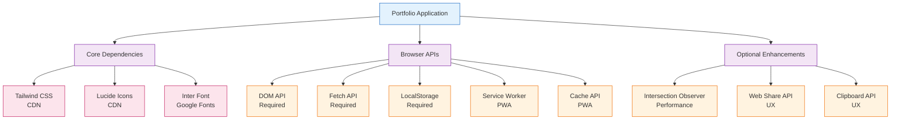

# Dependencies & External Libraries

## Overview

The David Vargas Portfolio maintains minimal external dependencies to ensure fast loading, security, and maintainability. All dependencies are carefully selected and loaded from reliable CDNs with fallback strategies.

## External Dependencies

### Core Runtime Dependencies

#### 1. Tailwind CSS
**Purpose**: Utility-first CSS framework  
**Version**: Latest via CDN  
**URL**: `https://cdn.tailwindcss.com`  
**Usage**: Responsive utilities, component styling, theme system  
**Fallback**: Basic CSS fallbacks in custom stylesheets  
**Security**: CSP allows `cdn.tailwindcss.com`

#### 2. Lucide Icons
**Purpose**: SVG icon library  
**Version**: Latest via CDN  
**URL**: `https://unpkg.com/lucide@latest`  
**Usage**: Consistent iconography throughout the UI  
**Fallback**: CSS-based icon alternatives  
**Security**: CSP allows `unpkg.com`

#### 3. Inter Font
**Purpose**: Professional typography  
**Version**: Latest via Google Fonts  
**URL**: `https://fonts.googleapis.com/css2?family=Inter:wght@300;400;500;600;700`  
**Usage**: Primary typeface for all text content  
**Fallback**: System font stack in CSS  
**Security**: CSP allows `fonts.googleapis.com`

### Development Dependencies

#### None
- **No build tools**: Static file deployment
- **No package managers**: Direct CDN loading
- **No development servers**: Served as static files

## Dependency Management Strategy

### CDN-First Approach
```html
<!-- Primary: CDN with integrity checks where possible -->
<script src="https://cdn.tailwindcss.com"></script>
<script src="https://unpkg.com/lucide@latest" defer></script>

<!-- Fallback: Local copies (not implemented, but strategy defined) -->
<script>
  // Fallback loading strategy
  function loadFallback(resource, fallbackUrl) {
    // Implement fallback loading logic
  }
</script>
```

### Version Management
- **Latest Versions**: Use latest versions for security updates
- **No Pinning**: Accept automatic updates for bug fixes
- **Testing Required**: Test after CDN updates
- **Fallback Strategy**: Graceful degradation if CDN fails

### Security Considerations
```html
<!-- Content Security Policy -->
<meta http-equiv="Content-Security-Policy" content="
  default-src 'self';
  script-src 'self' 'unsafe-inline' https://cdn.tailwindcss.com https://unpkg.com;
  style-src 'self' 'unsafe-inline' https://fonts.googleapis.com https://cdn.tailwindcss.com;
  font-src https://fonts.gstatic.com;
  img-src 'self' data: https:;
  connect-src 'self' https://unpkg.com;
  object-src 'none';
  base-uri 'self';
  form-action 'self';
  upgrade-insecure-requests;
">
```

## Browser API Dependencies

### Critical APIs (Required)

#### 1. DOM API
**Purpose**: Core web page manipulation  
**Support**: All modern browsers  
**Fallback**: Progressive enhancement  
**Usage**: Element selection, content updates, event handling

#### 2. Fetch API
**Purpose**: Network requests for translations  
**Support**: IE11+ (with polyfill)  
**Fallback**: XMLHttpRequest  
**Usage**: Loading language files

#### 3. LocalStorage API
**Purpose**: User preference persistence  
**Support**: IE8+  
**Fallback**: In-memory storage  
**Usage**: Theme, language, reading mode preferences

### Progressive Web App APIs (Optional)

#### 4. Service Worker API
**Purpose**: Offline functionality and caching  
**Support**: Modern browsers (not IE)  
**Fallback**: Online-only functionality  
**Usage**: Resource caching, background sync

#### 5. Web App Manifest API
**Purpose**: PWA installation and metadata  
**Support**: Modern browsers  
**Fallback**: Standard web app behavior  
**Usage**: App installation, home screen icons

#### 6. Cache API
**Purpose**: Programmatic caching within Service Worker  
**Support**: Modern browsers with Service Worker  
**Fallback**: Network requests only  
**Usage**: Stale-while-revalidate caching

### Enhancement APIs (Nice-to-have)

#### 7. Intersection Observer API
**Purpose**: Performance-optimized scroll animations  
**Support**: Modern browsers  
**Fallback**: Immediate animation triggering  
**Usage**: Lazy-loading content animations

#### 8. Web Share API
**Purpose**: Native sharing functionality  
**Support**: Mobile browsers primarily  
**Fallback**: Clipboard API or custom sharing  
**Usage**: Share page functionality

#### 9. Clipboard API
**Purpose**: Copy-to-clipboard functionality  
**Support**: Modern browsers  
**Fallback**: `document.execCommand('copy')`  
**Usage**: Link sharing fallback

## Dependency Tree Analysis



## Fallback Strategies

### CDN Failure Handling
```javascript
// Example fallback strategy for critical resources
function loadWithFallback(primaryUrl, fallbackUrl, callback) {
  const script = document.createElement('script');
  script.src = primaryUrl;
  script.onload = callback;
  script.onerror = function() {
    if (fallbackUrl) {
      const fallbackScript = document.createElement('script');
      fallbackScript.src = fallbackUrl;
      fallbackScript.onload = callback;
      document.head.appendChild(fallbackScript);
    } else {
      console.warn('Failed to load script:', primaryUrl);
      // Continue with reduced functionality
    }
  };
  document.head.appendChild(script);
}
```

### API Availability Checks
```javascript
// Feature detection and graceful degradation
function initializeFeatures() {
  // Service Worker (PWA)
  if ('serviceWorker' in navigator) {
    navigator.serviceWorker.register('/sw.js');
  } else {
    console.log('Service Worker not supported');
  }

  // Web Share API
  if ('share' in navigator) {
    // Use native sharing
  } else {
    // Fallback to clipboard
  }

  // Intersection Observer
  if ('IntersectionObserver' in window) {
    // Use for lazy animations
  } else {
    // Trigger animations immediately
  }
}
```

### Progressive Enhancement Pattern
```javascript
// Enhance existing functionality
function enhanceSharing() {
  const shareButtons = document.querySelectorAll('.share-btn');

  shareButtons.forEach(button => {
    // Basic functionality (always works)
    button.addEventListener('click', basicShare);

    // Enhanced functionality (if supported)
    if ('share' in navigator) {
      button.addEventListener('click', enhancedShare);
    }
  });
}
```

## Performance Impact

### Loading Performance
- **Tailwind CSS**: ~100KB (gzipped), cached globally
- **Lucide Icons**: ~50KB (gzipped), loaded once
- **Inter Font**: ~200KB (total), subset loaded
- **Total External**: ~350KB initial load

### Caching Strategy
- **CDN Caching**: Resources cached at CDN level
- **Service Worker**: Additional browser-level caching
- **Font Loading**: `font-display: swap` for performance
- **Icon Loading**: Deferred loading with `defer`

### Bundle Size Optimization
- **No JavaScript Bundling**: Individual files loaded as needed
- **Deferred Loading**: Non-critical scripts use `defer`
- **Lazy Loading**: Search functionality loads on demand
- **Tree Shaking**: Manual elimination of unused code

## Maintenance Considerations

### Dependency Updates
- **Automatic Updates**: CDN always serves latest versions
- **Breaking Changes**: Monitor CDN changelogs
- **Testing Required**: Validate after major updates
- **Rollback Plan**: Keep local copies for critical resources

### Security Monitoring
- **CSP Violations**: Monitor for blocked resources
- **Integrity Checks**: Consider SRI for critical resources
- **Vulnerability Scanning**: Regular security audits
- **Access Control**: Restrict to approved CDNs

### Browser Compatibility
- **Support Matrix**: Test on target browsers
- **Polyfills**: Consider for critical missing APIs
- **Fallback Testing**: Validate degraded experiences
- **Progressive Enhancement**: Ensure core functionality works

## Migration Strategies

### Adding New Dependencies
1. **Evaluate Need**: Is the dependency essential?
2. **Check CDN Availability**: Reliable hosting?
3. **Security Review**: CSP and SRI considerations
4. **Fallback Strategy**: Graceful degradation plan
5. **Performance Impact**: Loading time and bundle size
6. **Testing**: Cross-browser validation
7. **Documentation**: Update dependency documentation

### Removing Dependencies
1. **Impact Assessment**: What functionality depends on it?
2. **Fallback Implementation**: Replace with custom solution
3. **Testing**: Ensure no regressions
4. **Documentation Update**: Remove from dependency list
5. **CSP Update**: Remove from allowed domains

## Risk Assessment

### High Risk Dependencies
- **Tailwind CSS**: Large payload, potential loading delays
- **External Fonts**: Render blocking, network dependent
- **CDN Reliability**: Single points of failure

### Medium Risk Dependencies
- **Lucide Icons**: Smaller payload, less critical
- **Browser APIs**: Feature detection mitigates risk
- **Service Worker**: Graceful degradation available

### Low Risk Dependencies
- **LocalStorage**: Ubiquitous browser support
- **DOM API**: Fundamental web technology
- **Fetch API**: Well-supported with fallbacks

## Future Considerations

### Potential Additions
- **Analytics**: Privacy-focused usage tracking
- **Error Monitoring**: Client-side error reporting
- **Performance Monitoring**: Real user monitoring
- **PWA Enhancements**: Push notifications, background sync

### Modern Alternatives
- **CSS Frameworks**: Consider native CSS features over frameworks
- **Icon Systems**: Evaluate inline SVGs vs external libraries
- **Font Loading**: Modern font loading strategies
- **JavaScript Modules**: Native ES modules vs bundlers

### Deprecation Planning
- **Legacy Browser Support**: Plan for IE11 end-of-life
- **API Changes**: Monitor browser API evolution
- **CDN Changes**: Prepare for hosting changes
- **Security Updates**: Regular dependency audits